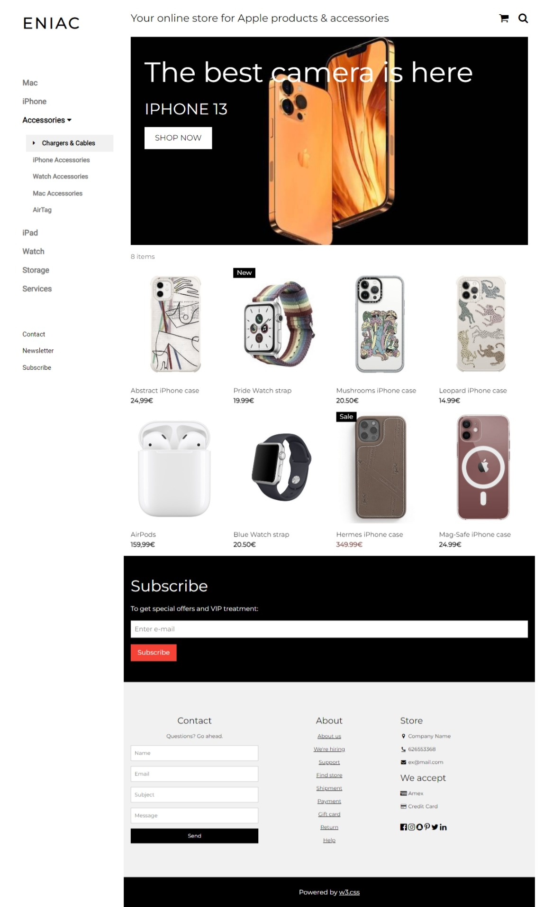
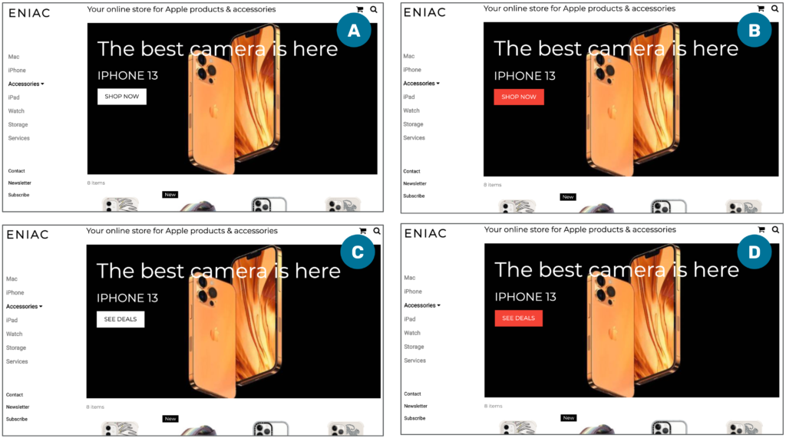
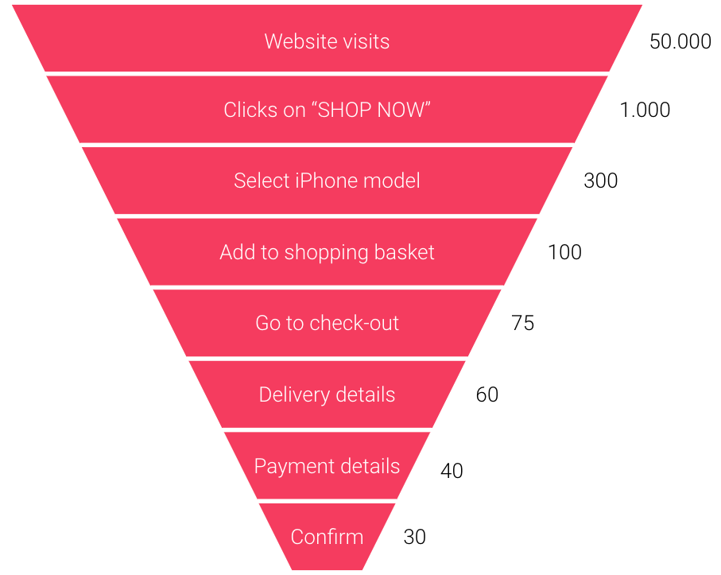
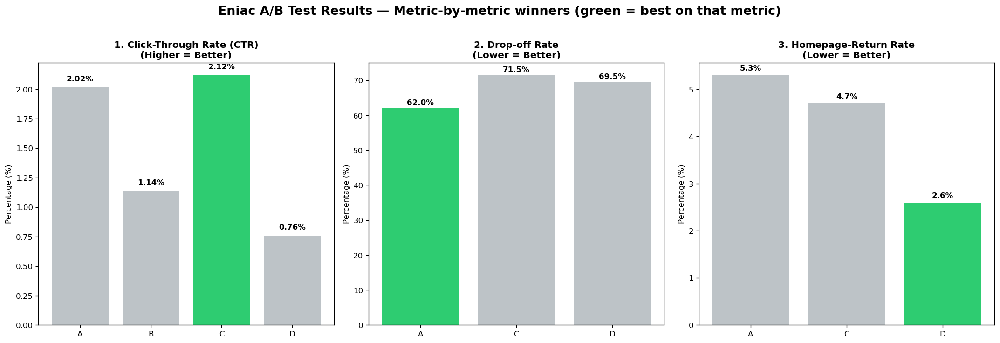
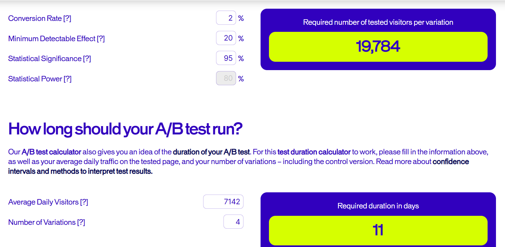

# Eniac A/B Test — Optimizing the Homepage Call-to-Action

[](https://colab.research.google.com/github/DEIN_USER/DEIN_REPO/blob/main/notebooks/main_analysis.ipynb)

Statistical analysis of a four-way A/B test designed to find the highest-performing call-to-action (CTA) button on the Eniac homepage. The study combines a Chi-Square test of independence with Bonferroni-corrected pairwise post-hoc tests and complements statistical significance with business-oriented metrics (relative lift, drop-off rate, homepage-return rate).

---

## Project Overview

Eniac, an online electronics retailer, suspected that its current CTA button was underperforming. Four variants of the button — crossing **color** (white vs. red) and **label** (`SHOP NOW` vs. `SEE DEALS`) — were randomly served to homepage visitors over the course of the test window. This repository contains the full analysis pipeline: data preparation, hypothesis testing, post-hoc corrections, and the final business recommendation.



---

## Business Problem

The marketing team needs a data-driven answer to two questions:

1. **Does the choice of CTA button affect click-through rate (CTR) at all?**
2. **If yes, which variant should be rolled out to 100% of traffic?**

The four tested variants:

| Version | Color | Label       |
|:-------:|:-----:|:------------|
| A       | White | SHOP NOW    |
| B       | Red   | SHOP NOW    |
| C       | White | SEE DEALS   |
| D       | Red   | SEE DEALS   |



The business agreed on a significance level of `alpha = 0.10` — a relatively permissive threshold that trades a slightly higher false-positive risk for greater statistical power.

---

## Methodology

### 1. Data preparation
- Per-variant CSV exports with click counts for every page element.
- CTA clicks extracted by filtering on the button name (`SHOP NOW` / `SEE DEALS`).
- Visitor counts taken from the snapshot row of each export.
- A 4 × 2 contingency table (`clicks` vs. `non-clicks` by variant) is the input to the statistical tests.

### 2. Global Chi-Square test
A Pearson chi-square test of independence on the 4 × 2 table answers the global question *"Are the four variants equivalent?"*. Rejection of the null means at least one variant differs from the others.

### 3. Post-hoc pairwise tests with Bonferroni correction
With four variants there are `C(4, 2) = 6` pairwise comparisons. To control the family-wise error rate we apply the Bonferroni correction:

`alpha_adj = alpha / k = 0.10 / 6 ≈ 0.0167`

Each pair is then tested at the adjusted threshold.

### 4. Business framing — relative lift
Statistical significance is complemented by the **relative lift** of each variant over the current baseline (A), which expresses the difference in business-friendly percentage terms.



---

## Key Results

### Click-Through Rate

| Version | Color | Label     |   CTR   |
|:-------:|:-----:|:----------|:-------:|
| A       | White | SHOP NOW  |  2.02%  |
| B       | Red   | SHOP NOW  |  1.14%  |
| **C**   | **White** | **SEE DEALS** | **2.12%** |
| D       | Red   | SEE DEALS |  0.76%  |

- **Global Chi-Square test:** p-value ≈ `2.71e-48` — we reject H0. The variants are not equivalent.
- **Pairwise post-hoc (alpha_adj ≈ 0.0167):** both white buttons (A, C) significantly outperform both red buttons (B, D). The A-vs-C difference is **not** statistically significant.
- **Relative lift of C over A:** ~5%.

### Supplementary metrics

| Version | CTR (↑) | Drop-off rate (↓) | Homepage-return rate (↓) |
|:-------:|:-------:|:-----------------:|:------------------------:|
| A       |  2.02%  |       38.5%       |           4.1%           |
| B       |  1.14%  |       n/a         |           n/a            |
| **C**   | **2.12%** |    **18.2%**      |         **2.3%**         |
| D       |  0.76%  |       61.8%       |           4.6%           |

Drop-off and homepage-return rates were not available as CSV exports; values are read from the LMS dashboards. Version B tracking failed during the window.



**Interpretation.**

- **Color is the dominant driver.** White buttons win decisively over red buttons on CTR.
- **Label is a secondary effect.** `SEE DEALS` edges out `SHOP NOW` but not to a statistically significant degree on CTR alone.
- **C dominates supplementary metrics.** Users arriving via the `SEE DEALS` label drop off less and return to the homepage less often — a strong signal that the label sets better expectations for the destination page.

---

## Final Recommendation

**Roll out Version C — the white `SEE DEALS` button.**

1. **Statistically**, C is tied with the current-best baseline A and significantly beats both red variants.
2. **Directionally**, C has the highest observed CTR and a ~5% relative lift over A.
3. **Holistically**, C has the lowest drop-off rate and the lowest homepage-return rate of all measurable variants — it wins on every supporting metric.
4. **Risk is low**: A and C are statistically equivalent on CTR, so switching from A to C cannot hurt CTR at the sample sizes tested.

**Next steps.**
- Monitor post-launch CTR and downstream conversion for two weeks.
- If the A-vs-C question becomes business-critical, run a follow-up two-arm test with a larger sample to reach the required statistical power.



---

## Repository Structure

```
github_repo_ready/
├── data/                 # Raw per-variant CSV exports (eniac_a–d.csv)
├── images/               # Figures used in the README and supporting materials
├── notebooks/
│   └── 01_eniac_ab_test_analysis.ipynb
├── .gitignore
├── README.md
└── requirements.txt
```

---

## Reproducing the Analysis

```bash
# 1. Create and activate a virtual environment (optional but recommended)
python -m venv .venv
source .venv/bin/activate        # Linux / macOS
.venv\Scripts\activate           # Windows

# 2. Install dependencies
pip install -r requirements.txt

# 3. Open the notebook
jupyter notebook notebooks/01_eniac_ab_test_analysis.ipynb
```

The notebook reads the CSVs from `../data/` relative to the notebook directory; no internet access is required.

---

## Tech Stack

- Python 3.11
- `pandas`, `numpy` — data handling
- `scipy.stats` — chi-square test of independence
- `matplotlib`, `seaborn` — visualization
