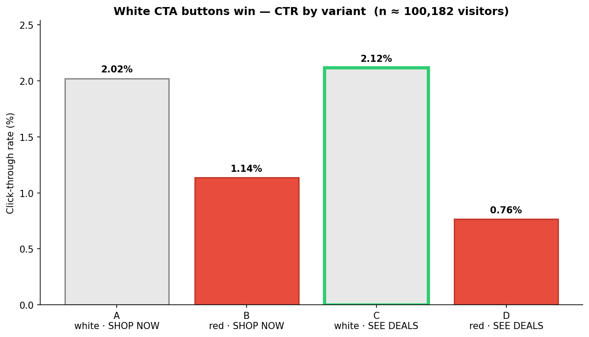

# Eniac A/B Test — Optimizing the Homepage Call-to-Action

[](https://colab.research.google.com/github/baris2828/eniac-ab-test-optimization/blob/main/notebooks/01_eniac_ab_test_analysis.ipynb)

> **White call-to-action buttons drove roughly double the click-through rate of red ones — a highly significant difference (χ² test, p ≈ 2.7 × 10⁻⁴⁸; n ≈ 100,182 visitors across four variants).** Recommended rollout: **Variant C — the white "SEE DEALS" button** — the highest-CTR variant at **2.12%**, a ~4.8% directional lift over the current baseline A (though A and C are a statistical tie).



| Variant | Color | Label | CTR | vs. baseline A |
|:--:|:--:|:--|:--:|:--:|
| A (baseline) | White | SHOP NOW | 2.02% | — |
| B | Red | SHOP NOW | 1.14% | −44% |
| **C** | **White** | **SEE DEALS** | **2.12%** | **+4.8%** |
| D | Red | SEE DEALS | 0.76% | −62% |

A four-way A/B test on the Eniac homepage CTA button, crossing **color** (white vs. red) and **label** (`SHOP NOW` vs. `SEE DEALS`). Analysis: a Pearson chi-square test of independence, Bonferroni-corrected pairwise post-hoc tests, and business-oriented relative-lift framing.

---

## The problem

Eniac, an online electronics retailer, suspected its homepage call-to-action button was underperforming. Marketing needed a data-driven answer to two questions:

1. **Does the choice of CTA button affect click-through rate at all?**
2. **If yes, which variant should be rolled out to 100% of traffic?**


Four variants were served to randomly assigned visitors over the test window, crossing button color and label:


The business fixed the significance level at **α = 0.10** — a deliberately permissive threshold that trades a slightly higher false-positive risk for greater statistical power.

---

## Methodology

1. **Data preparation.** Per-variant CSV exports → CTA clicks extracted by button label (`SHOP NOW` / `SEE DEALS`), visitor counts read from each export's snapshot row → a **4 × 2 contingency table** (clicks vs. non-clicks by variant).
2. **Global chi-square test.** Pearson χ² of independence on the 4 × 2 table: **χ²(3) = 224.0, p = 2.72 × 10⁻⁴⁸** → reject H₀; the four variants are not equivalent.
3. **Post-hoc pairwise tests, Bonferroni-corrected.** Six pairwise comparisons at **α_adj = 0.10 / 6 ≈ 0.0167**. Result: **both white buttons (A, C) significantly beat both red buttons (B, D); A vs. C is _not_ significant** (p = 0.47). Color is the driver; label is a secondary effect.
4. **Business framing — relative lift.** C's CTR is ~4.8% above the baseline A: directionally positive and economically meaningful at Eniac's traffic scale, but — per step 3 — not significant on its own.


---

## Learnings — reading an A/B test honestly

The most important thing this analysis does is **not oversell its own result**. What a reviewer should take away:

- **A tiny p-value is not a big effect.** `p ≈ 2.7e-48` only says "the four variants aren't identical" — it is driven by the large white-vs-red gap **and** the huge sample (n ≈ 100k). At this scale even a trivial difference turns "highly significant." Significance answers *is it real?*, never *is it big?*
- **The winner ties on the margin that matters.** C's ~4.8% lift over A is **directional, not significant** (A vs. C: p = 0.47 > α_adj). The decision-grade finding is **color** (white > red), not **label** (SEE DEALS vs. SHOP NOW). Choosing C over A is a judgment call on directional evidence, not a proven win.
- **Sample size, α and multiplicity are handled explicitly.** ~25k visitors per arm; α = 0.10 chosen for power (a documented trade-off); the Bonferroni correction controls the family-wise error rate across the six pairwise tests instead of letting it balloon past 10%.
- **The data has real gaps — stated, not hidden.** Variant **B's tracking failed**, so it is missing from the supplementary metrics. Drop-off and homepage-return rates come from **dashboards without confidence intervals** → directional only. And the whole test measures **CTR, not revenue** — a click is not a purchase.
- **What the test shows vs. doesn't.** *Shows:* color drives CTR, white wins decisively, C is the safe highest-CTR choice with no significantly worse downside. *Doesn't show:* that C beats A on CTR (tie), a clean verdict on the drop-off / return trade-off (mixed), or any downstream revenue effect.

The supplementary metrics make the trade-off concrete — no single variant wins on everything:


Version **A** has the lowest drop-off, **D** the lowest homepage-return rate, and **C** sits between them on both — better post-click engagement than A, at the cost of more landing-page drop-off.

---

## Recommendation

**Roll out Variant C (white "SEE DEALS")** — as a *risk-contained* choice, not a proven landslide:

- On the only rigorously testable metric (CTR), C has the highest observed value and the largest lift over the status-quo baseline A, with **no statistically worse downside** (A and C are tied).
- Color is the dominant, statistically proven driver, and C is on the winning (white) side.
- Because the supplementary metrics are mixed and reported without confidence intervals, run a **confirmatory A-vs-C head-to-head test instrumented across the full funnel** (landing → click → purchase → homepage return), so the drop-off / return trade-off is resolved on **measured revenue** rather than directional dashboards.


---

## Reproducing the analysis

```bash
python -m venv .venv
source .venv/bin/activate        # Windows: .venv\Scripts\activate
pip install -r requirements.txt

jupyter notebook notebooks/01_eniac_ab_test_analysis.ipynb
```

The notebook auto-loads the CSVs from `data/` (no internet required) and runs top-to-bottom. The committed notebook already includes all outputs and figures, so it reads as a finished report on GitHub.

---

## Tech stack

`Python 3.11` · `pandas` · `numpy` · `scipy.stats` (chi-square) · `matplotlib` · `seaborn` — versions pinned in `requirements.txt`.

## License

[MIT](LICENSE) © 2026 Baris Aydin
